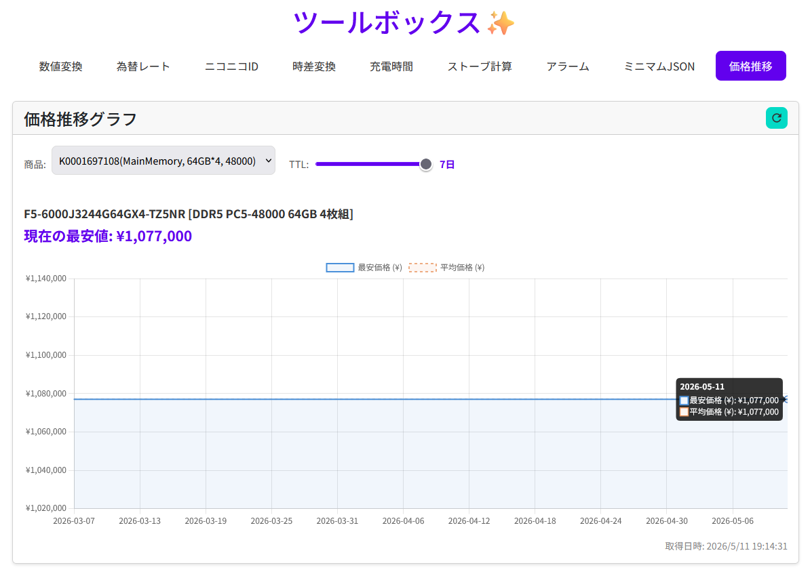

# ツールボックス

個人用ウェブツール集。Express + Vite + TypeScript で構築されたオールインワンのユーティリティアプリケーション。

## 使い方

### 初回セットアップ

```powershell
# 依存関係をインストール
bun install

# （管理者 PowerShell）ログオン時にサーバーを自動起動するタスクを登録
Register-NanaseToolboxTask.ps1
```

### 起動／停止

```powershell
# 手動でサーバーを起動（起動済みの場合は PM2 で再起動）
.\start-server.ps1

# サーバーを停止（PM2 登録と直接起動した node プロセスを確認して停止）
.\stop-server.ps1
```

サーバーは `http://localhost:65505/` で起動します。  
`Register-NanaseToolboxTask.ps1` を実行しておけば、ログオン時に自動で起動します。

`start-server.ps1` は PM2 への登録有無を先に調べ、未登録なら起動、登録済みなら再起動します。処理後には PM2 の状態、PID、再起動回数と HTTP 応答を表示します。`stop-server.ps1` も停止後に PM2 と直接起動プロセスが存在しないことを確認します。詳細は `start-server.log` と `stop-server.log` に UTF-8 で記録され、文字化けしやすい PM2 の表形式出力は保存しません。

## 機能一覧

- **数値変換** — 通貨換算（USD ⇄ JPY）とAIパラメーター単位変換
- **為替レート** — リアルタイムの USD/JPY レート表示
- **ニコニコID** — テキストからニコニコ動画 ID を抽出
- **時差変換** — 複数タイムゾーン間の時刻変換
- **充電時間** — バッテリー充電時間の計算
- **ストーブ計算** — 燃料・ストーブの燃焼時間と湯沸かし計算
- **アラーム** — 指定時刻に音楽ファイルを再生
- **ミニマムJSON** — JSON のキー短縮・minify によるトークン削減
- **価格推移** — [kakaku.com](https://kakaku.com) の価格推移グラフ表示（サーバーサイドプロキシ経由）

## 技術スタック

| レイヤー | 技術 |
|---------|------|
| フロントエンド | TypeScript, Vite, Bootstrap 5, Chart.js, jQuery |
| バックエンド | Express (Node.js), TypeScript |
| パッケージ管理 | Bun |

## Sakura AI単位変換の設定

通貨変換では「400おくどる」「2.5 billion dollars」などをそのまま入力できます。一般的な表記はローカルで解析し、曖昧な自然文だけSakura AIで補完します。AIパラメーター単位変換では、全角・半角や空白の違いを吸収し、「億単位で」「小数2桁で」などの表示方法を文章で指定できます。Sakura AIは入力の解釈だけを行い、数値計算はサーバー側の確定的な処理で実行します。

Sakura AIのコントロールパネルで発行したアカウントトークンをコピーしてから、次のスクリプトを実行します。長いトークンを手入力する必要はありません。スクリプトは `UUID:シークレット` 形式を検証し、読み取り直後にクリップボードを消去します。トークンはリポジトリ外のWindowsユーザー領域へDPAPIで暗号化保存され、ソースコード、ブラウザ、Git、ログには保存されません。

```powershell
.\set-sakura-ai-token.ps1
.\stop-server.ps1
.\start-server.ps1
```

クリップボードを使えない環境では、伏字入力へ切り替えられます。

```powershell
.\set-sakura-ai-token.ps1 -Prompt
```

保存済みトークンを削除する場合は、次を実行します。

```powershell
.\set-sakura-ai-token.ps1 -Remove
```

既定モデルは、軽量なパブリックプレビューモデル `preview/Qwen3-0.6B-cpu` です。プレビュー提供が終了した場合や別の利用可能モデルを選ぶ場合は、サーバー起動前に `SAKURA_AI_MODEL` 環境変数で差し替えられます。

単位変換時に入力した文章はSakura AIへ送信されます。トークン自体がブラウザやSakura AIへの入力文へ含まれることはありません。

## セットアップ

```bash
bun install
```

## 開発

```bash
# サーバーとフロントエンドの同時ビルド
bun run build

# フロントエンドのみビルド
bun run build:frontend

# サーバーのみビルド
bun run build:server

# 本番起動
bun run start
```

サーバーは `http://localhost:65505/` で起動します。

## プロジェクト構成

```
front-src/        # フロントエンドソース（コンポーネント、スタイル、HTML）
server-src/       # サーバーソース（Express API）
frontend-dist/    # Vite ビルド出力
server-dist/      # TypeScript コンパイル出力
```

## プライベートリポジトリ

このリポジトリは個人利用を目的としたプライベートプロジェクトです。外部からのコントリビューションは受け付けていません。
